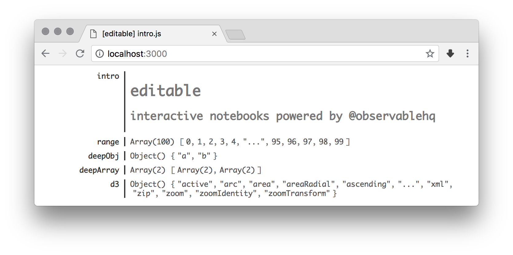

# `editable`
## Command line notebooks powered by [observablehq](https://beta.observablehq.com/)

Local notebooks written in pure javascript, with the same live-relaod functionality as Observable!



Install `editable`, create new file `editable-test.js` and run `editable ./editable-test.js`.

Create few cells using `def` global function (try saving the file between each edit to see live updates):

1. `def("a", 10)` - defines cell `a` to equal to `10`
2. `def("b", 20)` - defined cell `b` to equal to `20`
3. `def("sum", (a, b) => a + b)` - defines `sum` to be sum of `a` and `b`, changing either of those cells will result in updated `sum` value

Currently edited file is watched for changes, and frontend automatically refreshes (without full-page reloads) while keeping the cell state intact (unless that cell was changed).

More examples in `examples` directory.

Named by [Peter van Hardenberg](https://twitter.com/pvh).

### Why?

I like the idea of notebooks, but I also really like my text editor.

`editable` allows me to have both.

It was also fun getting to know [observable/notebook-runtime](https://github.com/observablehq/notebook-runtime).

### Installation

```bash
npm install -g editable-cli
```

### Running

1. `editable ./file.js`
2. open URL logged to console by `editable`

